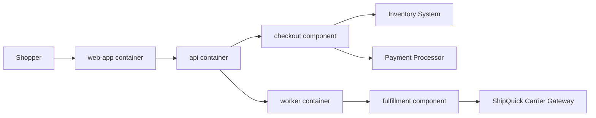

# Example System: OrderHub

OrderHub is a fictional order-management system used by retailers to receive web orders, reserve inventory, collect payment authorization, and coordinate fulfillment.

This example shows how SCMA artifacts can describe a structure graph and how RepoSCMA would place those artifacts in a repository.

## Structure Graph

```text
landscape: Retail Commerce
`- federation: Regional Retail Network
   |- enterprise: Northstar Retail
   |  `- system: OrderHub
   |     |- container: web-app
   |     |- container: api
   |     |- container: worker
   |     |- component: checkout
   |     |  `- module: pricing
   |     |     `- module: promotions
   |     `- component: fulfillment
   `- enterprise: ShipQuick Logistics
      `- system: Carrier Gateway
```

The OrderHub repo is concerned mostly with the `system: OrderHub` subtree, but its context artifact still needs to mention the federation and partner enterprise because fulfillment depends on them.

## Example Artifacts

### System Summary

OrderHub accepts customer orders from retail channels and coordinates payment, inventory reservation, and fulfillment handoff.

### System Context

OrderHub operates inside the Regional Retail Network federation. Northstar Retail owns OrderHub. ShipQuick Logistics owns the external Carrier Gateway used for shipping labels, pickup windows, and delivery status.

### System Interfaces

- HTTPS API for checkout submission
- webhook receiver for payment authorization updates
- event stream for inventory reservation results
- outbound REST calls to Carrier Gateway

### System Functions

- validate carts
- price orders
- reserve inventory
- authorize payment
- create fulfillment requests
- publish order state changes

### System Qualities

- checkout submission should remain available during downstream carrier outages
- order state transitions must be auditable
- payment authorization and inventory reservation must be idempotent
- fulfillment handoff should degrade to retryable queueing when ShipQuick is unavailable

## Diagram Artifact

Artifacts may include diagrams when they help. A diagram is still an artifact attached to a structural node; it is not the structure itself.



## RepoSCMA Placement

One reasonable RepoSCMA layout for this system:

```text
orderhub/
|- README.md
|- docs/
|  |- CONTEXT.md
|  |- INTERFACES.md
|  `- QUALITIES.md
|- tasks/
|  |- TODO.md
|  |- IDEAS.md
|  `- DONE.md
|- conts/
|  |- web-app/
|  |  `- README.md
|  |- api/
|  |  `- README.md
|  `- worker/
|     `- README.md
`- comps/
   |- checkout/
   |  |- README.md
   |  `- src/
   |     `- pricing/
   |        |- README.md
   |        `- promotions/
   |           `- README.md
   `- fulfillment/
      `- README.md
```

The root README would carry the system summary and high-level navigation. Root `docs/` would hold system-level spillover. Container READMEs would explain runtime units. Component and module READMEs would carry local responsibilities, interfaces, functions, and quality constraints.

## Task Example

```markdown
# TODO

## ORD-014: Make fulfillment handoff retryable

- [ ] Add idempotency key to Carrier Gateway requests
- [ ] Persist retry state in worker queue
- [ ] Document fulfillment outage behavior in `docs/QUALITIES.md`
- [ ] Add integration test for duplicate fulfillment requests
```

This task is not just project management. It is the synchronization point between code, tests, durable quality documentation, and the eventual commit or merge request.
