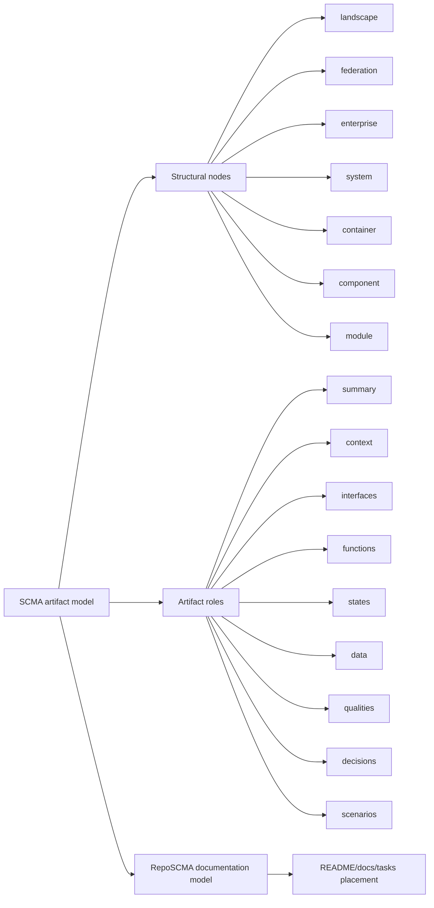
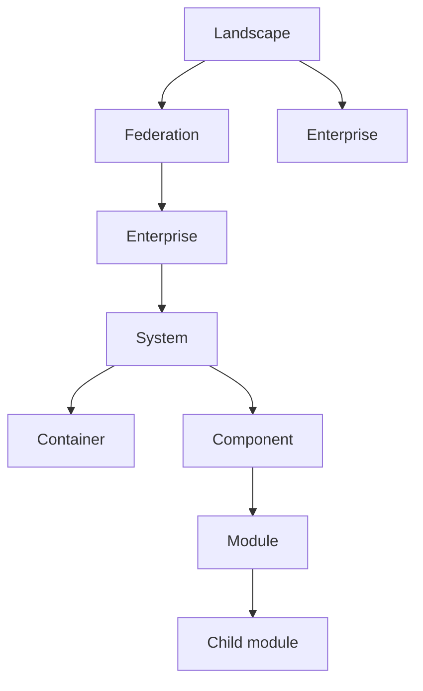
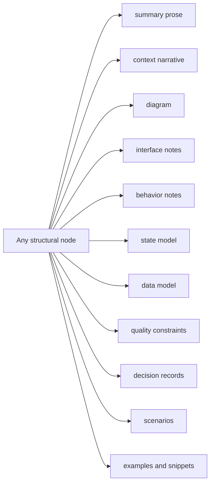
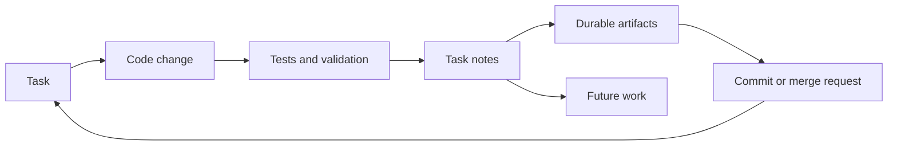

# RepoSCMA Manifesto

By Jeremy Kassis and the RepoSCMA Working Group.

Software systems do not live only in code, diagrams, tickets, or meetings. They live in the relationship between those things. That relationship matters even more when work moves between developers, teams, and AI agents. Each handoff forces the next worker to answer the same questions: what is this repo, where are the boundaries, what changed, what is still true, and where should new knowledge go?

RepoSCMA is a documentation model for keeping those answers inspectable in the one place every implementation already has: the repository. Its goal is not just better documentation. Its goal is consistent work: developers and agents should be able to enter different repos, find the same kinds of facts in predictable places, make changes with less rediscovery, and leave behind state that the next worker can trust.

RepoSCMA builds on SCMA, but it is not the same thing.

## TL;DR

- SCMA is the artifact model: it names the structural nodes and artifact types used to explain systems.
- RepoSCMA is the repo documentation model: it maps SCMA artifacts into README, docs, tasks, and repo layout conventions.
- The SCMA structure graph includes landscapes, federations, enterprises, systems, containers, components, and modules.
- A landscape may contain federations and enterprises; a federation contains enterprises.
- `context` is an artifact, not the top architecture node.
- Core artifact roles are summary, context, components, interfaces, functions, states, data, qualities, decisions, and scenarios.
- Artifacts can be prose, diagrams, tables, examples, interface snippets, or any useful combination of those forms.
- RepoSCMA keeps task state near code so plans, implementation, and durable docs can be synchronized.
- Predictable repo-local structure helps humans and AI agents produce consistent results across repos instead of rebuilding context from scratch.

SCMA is the artifact model:

- Landscapes
- Federations
- Enterprises
- Systems
- Containers
- Components
- Modules
- Artifacts

RepoSCMA is the repo documentation model that applies those artifacts to concrete files, directories, and task records. It is intentionally opinionated about layout because agents and humans both need predictable places to look. A repeated layout becomes an operating contract: when every repo answers common questions in familiar locations, agents can plan with fewer assumptions and developers can review or continue their work without reverse-engineering the local documentation culture first.

<script type="module">
  import mermaid from "https://cdn.jsdelivr.net/npm/mermaid@10/dist/mermaid.esm.min.mjs";

  mermaid.initialize({ startOnLoad: false, theme: "default" });

  document.addEventListener("DOMContentLoaded", async () => {
    document.querySelectorAll("pre > code.language-mermaid").forEach((code) => {
      const wrapper = document.createElement("div");
      wrapper.className = "mermaid";
      wrapper.textContent = code.textContent;
      code.parentElement.replaceWith(wrapper);
    });
    await mermaid.run({ querySelector: ".mermaid" });
  });
</script>

## The Core Distinction

SCMA defines the kinds of architectural artifacts worth maintaining. RepoSCMA defines where those artifacts live in a repository and how they stay synchronized with work.

That distinction matters. A system can be described by many artifacts: summaries, contexts, interfaces, functions, states, data, qualities, decisions, scenarios, runbooks, and task records. None of those artifacts are the system. They are lenses on the system.

This is one reason RepoSCMA does not treat `context` as the top of the architecture. Unlike C4, where a context diagram often appears as the outermost architectural view, RepoSCMA starts from structural nodes in a structure graph. Context is an artifact that can describe any node.



## Structure Graphs

A structure graph is the set of structural nodes that matter to a system and the relationships between them.

Common structural nodes include:

- landscape
- federation
- enterprise
- system
- container
- component
- module

A landscape is the broadest environment under consideration. It may include federations and independent enterprises.

A federation is a cooperating group of enterprises with shared concerns, interfaces, governance, data exchange, or operating models.

An enterprise is an organization or organizational unit that owns capabilities, systems, and operational responsibilities.

For a single repository, the repo usually maps to a system. Containers may live under `conts/`, components under `comps/`, and modules under `comps/<component>/src/<module>/`. Modules may also contain child modules when the implementation is naturally nested.

RepoSCMA does not pretend every system stops at the repo boundary. Artifacts can describe an enterprise, a federation, or any other surrounding structure when that context is necessary for understanding the repo.



## Artifacts

Artifacts are durable explanations attached to structural nodes. The core artifact types are:

- summary
- context
- components
- interfaces
- functions
- states
- data
- qualities
- decisions
- scenarios

A system can have a context. A container can have a state model. A module can have a data artifact. An enterprise can have qualities. A federation can have interfaces. The artifact type does not define the structural level.

Artifacts may be prose, copy intended for readers or users, diagrams, tables, schemas, command examples, API examples, or mixed-format documents. The artifact role is more important than the rendering format.

This keeps the model simple: first identify the structural node, then choose the artifacts that help readers reason about it.



## Selective Borrowing

SCMA stays deliberately small. It borrows from UML, OOAD, functional analysis, DDD, ER modeling, C4, BPMN, ADR practice, and operational runbooks, but it does not adopt any one modeling language as the organizing frame.

Modeling notations are rendering choices. Artifact roles are documentation responsibilities.

UML sequence diagrams, BPMN process models, ER diagrams, DDD aggregate sketches, C4 container views, activity diagrams, state machines, decision records, and runbooks can all be useful SCMA artifacts when they answer a real question for a real structural node. They should not become mandatory ceremony.

## Repo Layout Is Part of the Model

Documentation models that stop at vocabulary leave too much work to convention. RepoSCMA includes file placement because placement determines whether documentation is found, maintained, and trusted.

The default pattern is:

```text
repo/
|- README.md
|- docs/
|- tasks/
|- conts/
|  `- <container>/
|     |- README.md
|     `- docs/
`- comps/
   `- <component>/
      |- README.md
      |- docs/
      `- src/
         `- <module>/
            |- README.md
            `- docs/
```

The rule is README first, colocated `docs/` second. A `README.md` is the entry point for a structural node. A sibling `docs/` directory holds spillover when the README becomes too large, too detailed, or too mixed.

## Tasks Are Documentation

Systems evolve through work. Some teams use agile methods. Others use explicit phases such as analysis, design, construction, operation, and retirement. Many use external trackers. RepoSCMA does not replace those systems.

RepoSCMA does recommend repo-based task tracking for new or recently initiated projects, especially when LLM agents participate in the work.

Plain-text Markdown task files serve several purposes at once:

- human planning
- LLM planning
- execution checkpoints
- commit formation
- merge request formation
- durable historical context
- synchronization between code, artifacts, and intended work

The point is not that Markdown is the perfect task tracker. The point is that repo-local task state can be versioned with the code and documentation it explains.

## Synchronization

RepoSCMA treats documentation as a synchronization problem.

When code changes, tasks should reflect what was done. When tasks complete, durable findings should move into the right README, docs file, decision record, or runbook. When new work appears, it should be captured without polluting stable documentation.

This gives both humans and agents a practical loop that is repeatable across repositories:

1. Identify the current task.
2. Change the system.
3. Record execution state in the task.
4. Promote durable truth into artifacts.
5. Move future work into ideas or backlog.
6. Commit code, task state, and documentation together when appropriate.



## What RepoSCMA Optimizes For

RepoSCMA optimizes for repositories that need to be understood and changed repeatedly by mixed teams of humans and agents.

For AI-assisted development, consistency is not cosmetic. Agents are sensitive to where context lives, how current task state is represented, and whether stable design knowledge is separated from temporary execution notes. Repositories with a shared documentation shape give agents fewer chances to invent missing structure and give developers clearer evidence for reviewing, correcting, or continuing agent work.

For developers, the same structure reduces local folklore. A person moving from one repo to another should not need a new map for every codebase before they can make a safe change. RepoSCMA makes repository conventions explicit enough that implementation, review, onboarding, incident response, and follow-up work can reuse the same habits.

It values:

- predictable navigation
- artifact ownership
- colocated documentation
- clear structural boundaries
- task-aware evolution
- durable design memory
- repeatable AI and developer workflows across repos
- practical synchronization over documentation theater

It does not require every structural node to have every artifact. It does not require one file per artifact. It does not require diagrams before prose. It requires enough structure that the next maintainer, human or AI, can find the truth and update it without guessing.

## The Manifesto

Name the structure. Choose the artifacts. Put them where readers will look. Track the work near the code. Promote durable truth. Keep the repository honest.

That is RepoSCMA.

## Next

- [Glossary](glossary.md)
- [Example system](examples/orderhub.md)
